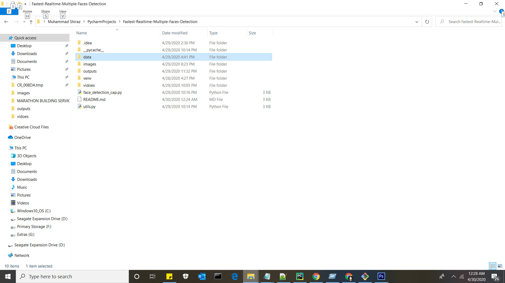
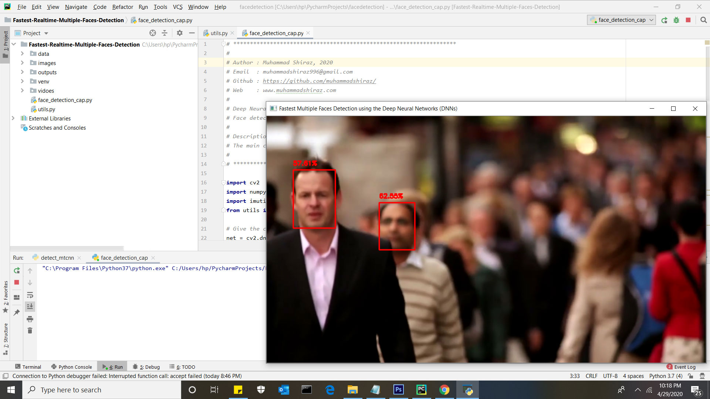

# Fastest Realtime Multiple Faces Detection
Fastest Realtime Multiple Faces Detection using the deep neural networks (dnn) module algorithm in OpenCV.

# OpenCV Deep Neural Networks (dnn module)
OpenCV dnn module supports running inference on pre-trained deep learning models from popular frameworks such as TensorFlow, Torch, Darknet and Caffe.

<table>
  <tbody>
	<tr align="center"> 
		<th><strong>Walking in London Faces Detection</strong></th>
	</tr>
	<tr align="center">
		<td></td>
	</tr>
	<tr align="center">
        <th><strong>Walking in Melbourne Faces Detection</strong></th>
	</tr>
	<tr align="center">
		<td></td>
	</tr>
	<tr align="center">
        <th><strong>Walking in New York Faces Detection</strong></th>
	</tr>
	<tr align="center">
		<td></td>
	</tr>
</tbody>
</table>

# Imutils

Imutils are a series of convenience functions to make basic image processing functions such as translation, rotation, resizing, skeletonization, and displaying Matplotlib images easier with OpenCV and both Python 2.7 and Python 3

## Requirement
<ul>
<li>Python 3.7</li>
<li>OpenCV 4.2.0</li>
<li>imutils</li>
<li>numpy==1.15.4</li>
</ul>

## Quick start
<ul>
  <li>Download official <a href="https://github.com/thegopieffect/computer_vision/blob/master/CAFFE_DNN/deploy.prototxt.txt" rel="nofollow">deploy.prototxt</a> and place it under a folder called data/model.</li>
  <li>Download <a href="https://github.com/thegopieffect/computer_vision/blob/master/CAFFE_DNN/res10_300x300_ssd_iter_140000.caffemodel">res10_300x300_ssd_iter_140000.caffemodel</a> and place it under a folder called data/weights.</li>
</ul>

## The Project Repository Directory Structure

<table>
  <tbody>
	<tr align="center">
		<th><strong>Firstly create data folder</strong></th>
	</tr>
	<tr align="center">
		<td></td>
	</tr>
	<tr align="center">
		<th><strong>Then create model folder inside data folder</strong></th>
	</tr>
	<tr align="center">
		<td></td>
	</tr>
	<tr align="center">
		<th><strong>And create weights folder inside data folder</strong></th>
	</tr>
	<tr align="center">
		<td></td>
	</tr>
</tbody>
</table>

## Dependencies
<ul>
<li>opencv</li>
<li>numpy</li>
</li>imutils</li>
</ul>

## Install dependencies

<code>pip install opencv-python</code>

<code>pip install numpy</code>

<code>pip install imutils</code>

## How to use?
<ol>
  <li>Clone the repository</li>
  
<code>git clone https://github.com/muhammadshiraz/Fastest-Realtime-Multiple-Faces-Detection.git</code>

</ol>
<ol start="2">
  <li>Move to the directory</li>
  
<code>cd Fastest-Realtime-Multiple-Faces-Detection</code>

</ol>
<ol start="3">
  <li>To view the Fastest Realtime Multiple Faces Detection</li>
  
<code>python face_detection_cap.py</code>

</ol>

## Run by PyCharm IDE:

